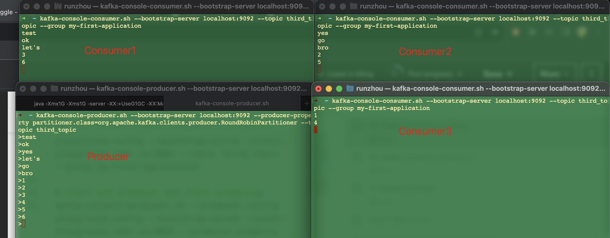
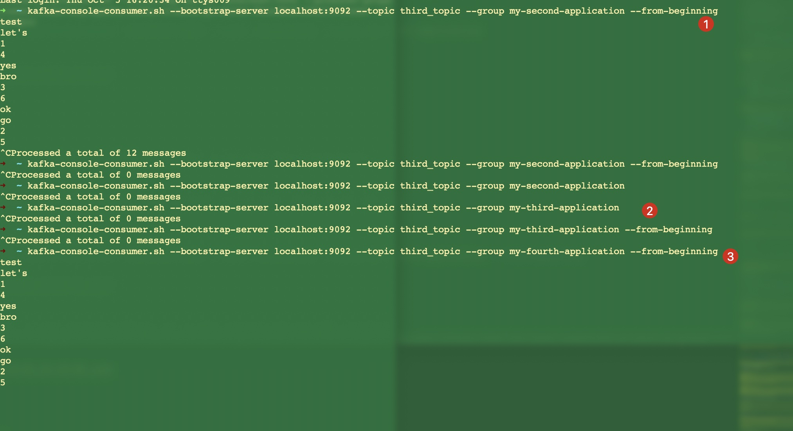
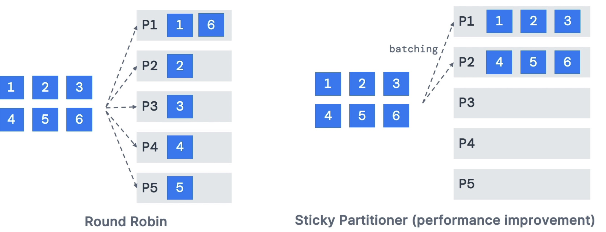
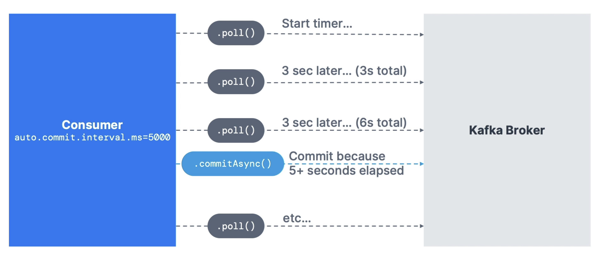
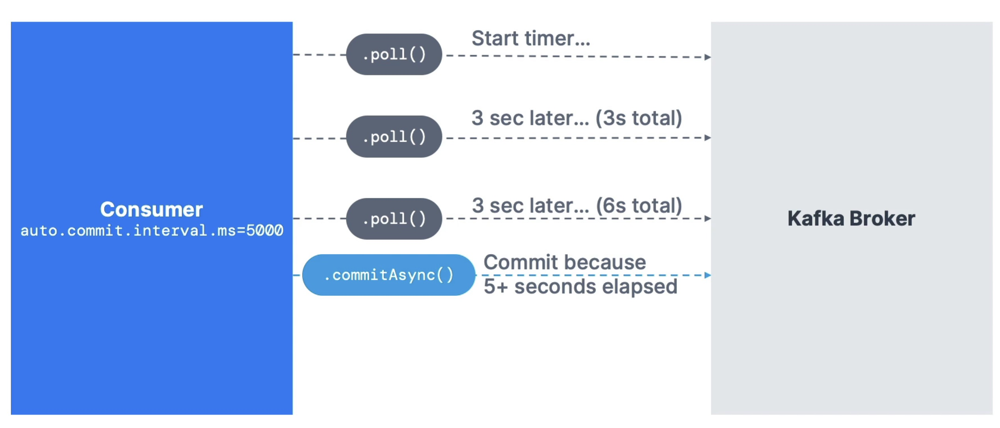
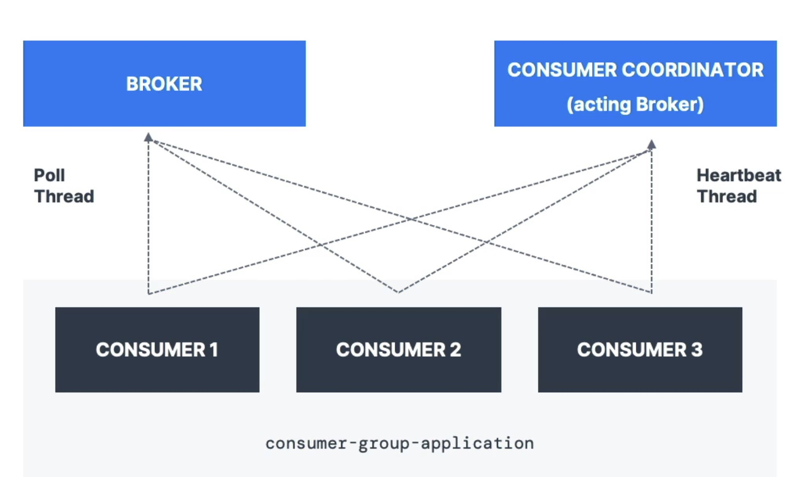

# kafka
This is the udemy course for kafka<br>
https://www.udemy.com/course/apache-kafka/learn/lecture/31409100?components=add_to_cart%2Cavailable_coupons%2Cbase_purchase_section%2Cbuy_button%2Cbuy_for_team%2Ccacheable_buy_button%2Ccacheable_deal_badge%2Ccacheable_discount_expiration%2Ccacheable_price_text%2Ccacheable_purchase_text%2Ccurated_for_ufb_notice_context%2Ccurriculum_context%2Cdeal_badge%2Cdiscount_expiration%2Cgift_this_course%2Cincentives%2Cinstructor_links%2Clifetime_access_context%2Cmoney_back_guarantee%2Cprice_text%2Cpurchase_tabs_context%2Cpurchase%2Crecommendation%2Credeem_coupon%2Csidebar_container%2Cpurchase_body_container#overview<br>


# Summary and Tips in front

## common tips
```bash
# I. Bash
# 1. find port listening
$ lsof -i -P -n | grep LISTEN


# II. Java
# 1. display java variable candidate
command + P 

# 2. try...catch

# select below then => command + option + T
Thread.sleep(500)

# 3. optimize imports, remove unused imports
control + option + O


```


## Thoughts
1. why we need partition in kafka
- How Partition count affects Kafka Performance. higher is your data throughput: Both the brokers and the producers can process different partitions completely independently – and thus in parallel. This allows these systems to better utilize the available resources and process more messages.

<br><br><br>

2. [Kubenetes autoscaling](https://www.densify.com/kubernetes-autoscaling/)

3. OpenSearch, opensource version of elasticsearch

4. different between URI and URL
    - URL is the subset of URI.
    - URI identifies a resource and differentiates it from others by using a name, location, or both. 
    - URL identifies the web address or location of a unique resource. 
    - URI contains components like a scheme, authority, path, and query.


<br><br><br><br><br><br>

# 0. Setup

1. about kafka
    - data movement between systems become a problem
    - 4 src systems, 6 dest systems need 24 integrations
    - each integration comes with difficulties
        - protocol - how the data is transported(TCP, HTTP, REST, FTP, JDBC...)
        - data format - how the data is parsed (Binary, CSV, JSON, Avro, Protobuf...)
        - Data schema & evolution - how the data is shaped and may change
    - each src system will have an increased load from the connections
        - 
    - why kafka? decoupling of data streams & systems
        - 
        - 
        
    - why kafka so good?
        1. Created by linkedin, now open-source project mainly maintained by confluent, IBM, Cloudera
        2. Distributed, resilient architecture, fault tolerant
        3. horizontal scalability:
            - can scale to 100s of brokers
            - can scale to millions of msgs per second
        4. high performance(latency of less than 10ms) - real time
        5. used by the 2000+ firms, 80% of the fortune 100
    - Kafka use cases
        1. messaging system
        2. activity tracking
        3. gather metrics from many different locations
        4. application logs gathering
        5. stream processing (with the kafka strems API for example)
        6. de-coupling of system dependencies
        7. integrations with Spark, Flick, Storm, Hadoop, and many other big data tech
        8. micro-services pub/sub
    - FOR EXAMPELS
        1. `Netflix` uses kafka to apply recommendations in real-time while you're watching TV shows
        2. `Uber` uses kafka to gather uses, taxi and trip data in real-time to compute and forecast demand, and compute surge pricing in real-time
        3. `Linkedin` uses kafka to prevent spam, collect user interactions to make better connection recommendations in real time
    - `REMEMBER, kafka is only used as a transportation mechanism`

2. Course objectives
    - Course structures
        - Part 1
            1. Kafka Theory
            2. Starting Kafka
            3. Kafka CLI
            4. Kafka & Java101
        - Part 2
            1. wikimedia producer
            2. OpenSearch consumer
            3. extended API intro + case studies + kafka in the enterprise
        - Part 3
            1. Adavanced topic configuration
    - Who this course for
        - Developers, how to write and run an application that leverages kafka
        - Architects, understand role of kafka in the enterprise piepline
        - DevOps, how kafka works, topics, partitions and multi brokers setup
    
    - Kafka series
        1. kafka for beginners
        2. kafka connect API
        3. kafka streams API
        4. ksqlDB
        5. confluent components
        6. kafka security
        7. kafka monitoring and operations
        8. kafka cluster setup & administration
        9. confluent certifications for developers practice exams
        9. confluent certifications for operators practice exams

3. course material
    - download, https://www.conduktor.io/apache-kafka-for-beginners/
    - github, https://github.com/conduktor/kafka-beginners-course.git

<br><br><br><br><br><br>

# 1. Kafka theory

<br><br><br>

## 1.1 Topics, Partitions and offsets
1. Kafka Topics
    - `Topics`: a particular stream of daata
    - like a table in a database(without all the constraints)
    - you can have as many topics as you want
    - a topic is identified by its name
    - any kind of msg format
    - the sequence of msg is called a `data stream`
    - you cannot query topics, instead, use kafka producers to send data and kafka consumers to read the data

2. partitions and offsets
    - topics are split in `partitions`(example: 100 partitions)
        - msgs within each partition are ordered
        - each msg within a partition gets an incremental id, called `offset`
    - kafka topics are `immutable`: once data is written to a partition, it cannot be changed
    - 

3. Topic example: truck_gps
    - say u have a fleet of trucks, each truck reports its GPS position to kafka
    - each truck will send a msg to kafka every 20 seconds, each msg will contain the truck ID and truck position(latitude and longtidu)
    - you can have a topic `trucks_gps` that contains the position of all trucks
    - we choose to create that topic with 10 partitions (arbitrary number)
    - 
    

4. topics, partitions and offsets - important notes
    - once the data is written to a partition, `it can't be changed` (immutability)
    - data is kept only for a limited time(default is one week - configurable)
    - offset only have a meaning for a specific partition
        - e.g offset 3 in partition 0 doesn't represent the same data as offset 3 in partition 1
        - offsets are not re-used even if previous msgs have been deleted
    - order is guaranteed only within a partition (not across partitions)
    - data is assigned randomly to a partition unless a key is provided (more on this later)
    - you can have as many partiions per topic as you want

<br><br><br>

## 1.2 Producers and msg keys

1. producers
    - producers write data to topics (which are made of partitions)
    - producers know to which partition to write to (and which kafka broker has it)
    - in case of kafka broker failures, producers will automatically recover
    - 

2. producers: msg keys
    - producers can choose to send a `key` with the msg  (string, number, binary, etc...)
    - if key = null, data is sent round robin (partition 0, then 1, then 2...)
    - if key != null, then all msgs for that key will always go to the same partition (hashing)
    - a key are typically sent if you need msg ordering for a specific field(ex: truck_id)
    - 

3. kafka msg anatomy...
    - 

4. kafka msg serializer
    - kafka only accepts bytes as an input from producers and sends bytes out as an output to consumers
    - msg serialization means transforming objects/ data into bytes
    - they are used on the value and the key
    - common serializers
        - string (incl. JSON)
        - Int, Float
        - Avro
        - Protobuf
    - 

5. for the curious: kafka msg key hashing
    - a kafka partitioner is a code logic that takes a record and determines to which partition to send it into
    - `key hashing` is the process of determining the mapping of a key to a partition
    - in the default kafka partitioner, the keys are hased using the `murmur2 algorithm`, with the formula below for the curious:
    ```java
    targetPartition = Math.abs(Utils.murmur2(keyBytes)) % (numPartitions - 1)
    ```

<br><br><br>

## 1.3 Consumers & Deserialization
1. Consumers
    - consumers read data from a topic (identified by name) - pull model!
    - consumres automatically know which broker to read from
    - in case of broker failures, consumers know how to recover
    - data is read in order from low to high offset `within each paritions`
    - 

- Consumers Deserialization
    - deserialize indicates how to transform bytes into objects/ data
    - they are used on the value and the key of the msg
    - common deserializers
        - String(incl. JSON)
        - Int, Float
        - Avro
        - Protobuf
    - the serialization/ deserialization type must not change during a topic lifecycle (create a new topic instead)
    - 
    

<br><br><br>

## 1.4 Consumer Groups & Consumer Offsets
1. Consumer Groups
    - all the consumers in an application read data as a consumer groups
    - each consumer within a group reads from exclusive partitions
    - 

2. Consumer Groups - what if too many consumers?
    - if u have more consumers than partitions, some consumers will be inactive
    - 

3. Multiple Consumers on one topic
    - in apache kafka it is acceptable to have multiple consumer groups on the same topic
    - to create distinct consumer groups, use the consumer property group.id
    - 

4. Consumer Offsets
    - `Kafka` stores the offsets at which a consumer group has been reading
    - The offsets committed are in Kafka `topic` named `__consumer_offsets`
    - when a consumer in a group has processed data received from Kafka, it should be periodically committting the offsets(the kafka broker will write to __consumer_offsets, not the group itself)
    - if a consumer dies, it will be able to read back from where it left off thanks to the committed consumer offsets!
    - 

5. Delivery semantics for consumers
    - by default, Java consumers will automatically commit offsets (at least once)
    - there are 3 delivery semantics if you choose to commit manually
    - `At least once(usually preferred)`
        - offsets are committed after msg is processed
        - if the processing goes wrong, the msg will be read again
        - this can result in duplicate processing of msgs, make sure your processing is `idempotent` (i.e. processing again the msgs wont impact your systems)
    - `At most once`
        - offsets are committed as soon as msgs are received
        - if the processing goes wrong, some msgs will be lost(they won't be read again)
    - `Exactly once`
        - for kafka => kafka workflows: use the transactional API (easy with kafka streams API)
        - for kafka => external system workflows: use an `idempotent` consumer

<br><br><br>

## 1.5 Brokers and Topics
1. Kafka Brokers
    - A kafka cluster is composed of multiple brokers(servers)
    - Each broker is identified with its ID(integer)
    - Each broker contains certain topic partitions
    - After connecting to any broker(called a bootstrap broker), you will be connected to the entire cluster(Kafka clients have smart mechnics for that)
    - A good number to get started is 3 broker, but some big clusters have over 100 brokers
    - In these examples we choose to number brokers starting at 100 (arbitrary)
    - 

2. Brokers and topics
    - example of Topic-A with `3 partitions` and Topic-B with `2 partitions`
    - note: data is distributed, and broker 103 doesn't have any Topic B data
    - 

3. Kafka Broker Discovery
    - Every kafka broker is also called a `bootstrap server`
    - That means that `you only need to connect to one broker`, and the kafka clients will know how to be connected to the entire cluster (smart clients)
    - each broker knows about all brokers, topics and partitions(metadata)
    - 

<br><br><br>

## 1.6 Topic replication
1. Topic replication factor
    - topics should have a replication factor > 1 (usually between 2 and 3)
    - this way if a broker is down, another broker can serve the data
    - example: topic-A with 2 partitions and replication factor of 2
    - 

    - example: we lose broker 102
    - result: broker 101 and 103 can still serve the data
    - 

2. Concept of Leader for a partition
    - `at any time only ONE broker can be a leader for a given partition`
    - `producers can only send data to the broker that is leader of a partition`
    - the other brokers will replicate the data
    - therefore, each partition has one leader and multiple ISR (in-sync replica)
    - 


3. Default producer & consumer behavior with leaders
    - Kafka producers can only write to the leader broker for a partition
    - Kafka consumers by default will read from the leader broker for a partition
    - 

4. Kafka consumers replica fetching (Kafka v2.4+)
    - since Kafka 2.4, it is possible to configure consumers to read from closest replica
    - This may help improve latency, and also decrease network costs if using the cloud
    - 

<br><br><br>

## 1.7 Producer acknowledgements & topic durability

1. Producer acknowledgements (acks)
    - producers can choose to receive acknowledgement of data writes:
        - `acks=0`: producer won't wait for acknowledgement(possible data loss)
        - `acks=1`: producer will wait for leader acknowledgement(limited data loss)
        - `acks=all`: leader + replicas acknowledgment (no data loss)
    - 

2. Kafka Topic durability
    - for a topic replication factor of 3, topic data durability can withstand 2 brokers loss.
    - as a rule, for a replication factor of N, you can permanently lose up to N-1 brokers and stil recover your data.
    - 
    

<br><br><br>

## 1.8 zookeeper
1. zookeeper
    - zookeeper manages brokers (keeps a list of them)
    - zookeeper helps in performing leader election for partitions
    - zookeeper sends notifications to kafka in case of changes (e.g. new topic, broker dies, broker comes up, delete topics, etc...)
    - `kafka 2.x can't work without zookeeper`
    - `kafka 3.x can work without zookeeper(KIP-500) - using kafka raft instead`
    - `kafka 4.x will not have zookeeper`
    - zookeeper by design operates with an odd number of servers (1, 3, 5, 7)
    - zookeeper has a leader(writes) the rest of the servers are followers(reads)
    - (zookeeper does NOT store consumer offsets with kafka >v0.10)

2. zookeeper cluster(ensemble)
    - 
    

3. should u use zookeeper?
    - with kafka brokers?
        - yes, until kafka 4.0 is out while waiting for kafka without zookeeper to be production-ready
    - with kafka clients?
        - over time, the kafka clients and CLI have been migrated to leverage the brokers as a connection endpoint instead of zookeeper
        - since kafka 0.10, consumers store offset in kafka and zookeeper and must not connect to zookeeper as it is deprecated
        - since kafka 2.2, the kafka-topics.sh CLI command references kafka brokers and not zookeeper for topic management(creation, deletion, etc..) and zookeeper CLI argument is deprecated
        - All the APIs and commands that were previously leveraging zookeeper are migrated to use kafka instead, so that when clusters are migrated to be without zookeeper, the chnage is invisible to clients
        - zookeeper is also less secure than kafka, and therefore zookeeper ports should only be opened to allow traffic from kafka brokers, and not kafka clients
        - `Therefore, to be a greate modern-day kafka developer, never ever use zookeeper as a configuration in your kafka clients, and other programs that connect to kafka`

<br><br><br>

## 1.9 kafka KRaft - removing zookeeper
1. about kafka KRaft
    - in 2020, the apache kafka project started to work `to remove the zookeeper dependency` from it (KIP-500)
    - zookeeper shows scaling issues when kafka clusters have > 100,000 partitions
    - by removing zookeeper, apache kafka can
        - scale to millions of partitions, and becomes easier to maintain and set-up
        - improve stability, makes it easier to monitor, support and administer
        - single security model for the whole system
        - single process to start with kafka
        - faster controller shutdown and recovery time
    - kafka 3.x now implements the Raft protocol (KRaft) in order to replace zookeeper
        - production ready since kafka 3.3.1(KIP-833)
        - kafka 4.0 will be released only with KRaft(no zookeeper)

2. kafka KRaft architecture
    - 

3. KRaft performance improvements
    - 

<br><br><br>

## 1.10 Theory Roundup
1. kafka concepts
    - 
    


<br><br><br><br><br><br>

# 2. Starting Kafka

## 2.1 Starting Order
1. Important: Starting Kafka
    - for the rest of the course, we will start kafka...
    - on the cloud with conduktor, with a secure connection
    - locally: it will be accessible on 127.0.0.1(localhost)
    - natively: we will use the native kafka binaries from the website
    - with ONE Broker and (optionally) ONE zookeeper only (perfect for development)
    - `Note`: the production-ready kafka cluster setup takes over 4 hours and is dedicated to another course in the apacha kafak series

2. kafka installation
    - https://www.conduktor.io/get-started/#via-docker
    ```bash
    $ curl -L https://releases.conduktor.io/quick-start -o docker-compose.yml && docker compose up -d --wait && echo "Conduktor started on http://localhost:8080"

    $ curl -L https://releases.conduktor.io/console -o docker-compose.yml && docker compose up -d --wait && echo "Conduktor started on http://localhost:8080"
    ```
    - 

## 2.2 start kafka

kafka tutorial: https://www.conduktor.io/kafka/how-to-install-apache-kafka-on-mac-with-homebrew/<br>

1. start from binary tgz
```bash
https://rickeve.conduktor.app/admin/members?page=1&tab=members

# 1. downlaod java11

# 2. download kafka
https://kafka.apache.org/downloads

# 3. setup kafak path
export PATH="$PATH:/Users/runzhou/git/kafka/kafka_2.13-3.5.1/bin"
```

2. mac os x
```bash
# 1. start zookeeper
$ zookeeper-server-start.sh kafka_2.13-3.5.1/config/zookeeper.properties 

# 2. start server
$ kafka-server-start.sh kafka_2.13-3.5.1/config/server.properties

```


3. max os x: start kafka using brew
```bash
# 1. install brew
$ /bin/bash -c "$(curl -fsSL https://raw.githubusercontent.com/Homebrew/install/HEAD/install.sh)"

# 2. install kafka using brew
$ brew install kafka

# 3. start zookeeper
# bash location
/usr/local/etc/kafka

# 4. start kafka
$ /usr/local/bin/zookeeper-server-start /usr/local/etc/zookeeper/zoo.cfg
$ /usr/local/bin/kafka-server-start /usr/local/etc/kafka/server.properties

```


<br><br><br><br><br><br>

# 3. Starting kafka without zookeeper

1. Mac OX: One Kafka Broker - KRaft Mode(no ZK)
```bash
# 1. generate custer id
$ kafka-storage.sh random-uuid
>>kmKLdL7fTl6zvDrhy2NfMw
>>961ganiYT_uWit-RmNwZaQ

# 2. format your storage directory
$ kafka-storage.sh format -t 961ganiYT_uWit-RmNwZaQ -c /Users/runzhou/git/kafka/kafka_2.13-3.5.1/config/kraft/server.properties
# /tmp/kraft-combined-logs - where data stored
>> Formatting /tmp/kraft-combined-logs with metadata.version 3.5-IV2.

# 3. starting kafka server
$ kafka-server-start.sh /Users/runzhou/git/kafka/kafka_2.13-3.5.1/config/kraft/server.properties
>>[2023-09-11 10:41:34,917] INFO [KafkaRaftServer nodeId=1] Kafka Server started (kafka.server.KafkaRaftServer)
```

- listen to port 9092


<br><br><br><br><br><br>


# 4. CLI 101

1. setup kafka path
```bash
# setup kafka path inside ~/zshrc
export PATH="$PATH:/Users/runzhou/git/kafka/kafka_2.13-3.5.1/bin"
```

<br><br><br>

## 4.1  Kafka Topics CLI
1. Create Kafka Topics
```bash
# create first topic
$ kafka-topics.sh --bootstrap-server localhost:9092 --topic first_topic --create
```
- 

- suspecious process created, probably the topic?
- 

```bash

# create topic with partitions
$ kafka-topics.sh --bootstrap-server localhost:9092 --topic second_topic --create --partitions 3
```
- 

```bash

# replicateion factor - replicate your topic in multiple servers, for disaster recovery purpose and high availability
#                     - you cannot have more factor number than brokers
$ kafka-topics.sh --bootstrap-server localhost:9092 --topic third_topic --create --partitions 3 --replication-factor 2

# you can only create topic with replication factor of 1, as we only have 1 broker
$ kafka-topics.sh --bootstrap-server localhost:9092 --topic third_topic --create --partitions 3 --replication-factor 1
```
- failed, as only 1 broker registered
- 
- create with 1 succeeded
- 

<br><br><br>

2. List Kafka Topics
```bash
$ kafka-topics.sh --bootstrap-server localhost:9092 --list
```
- 

<br><br><br>

3. Describe Kafka Topics
```bash
$ kafka-topics.sh --bootstrap-server localhost:9092 --topic first_topic --describe
```
- 

- partition count as 3, replace to each 3 brokers, ISR is in-sync replica
- 

<br><br><br>

4. Increase Partitions in a Kafka Topic

<br><br><br>

5. Delete a Kafka Topic

```bash
# delete first topic
$ kafka-topics.sh --bootstrap-server localhost:9092 --topic first_topic --delete
```
- 


<br><br><br>

## 4.2  Kafka Console Producer CLI

1. Produce without keys
2. Produce with keys
- 


```bash
# (1) create first_topic
$ kafka-topics.sh --bootstrap-server localhost:9092 --topic first_topic --create --partitions 1

# (2) produce to this first_topic
$ kafka-console-producer.sh --bootstrap-server localhost:9092 --topic first_topic 
>hello
>this is rick
>i'm practing Kafka
>^C%
```
- 


```bash
# (3) produce with properties
# acks=all - all the msg should be acked by all brokers
$ kafka-console-producer.sh --bootstrap-server localhost:9092 --topic first_topic --producer-property acks=all
>some msgs that is acked
>just for practicing
>carry on
>^C%

# (4) produce to non-exist topic
#       1st time product to a non-exist topic failed
#       but it will create this topic after, that it's successful
#       you can verify that but --list cmd
$ kafka-console-producer.sh --bootstrap-server localhost:9092 --topic new_topic
>hello there!
[2023-10-05 15:23:16,722] WARN [Producer clientId=console-producer] Error while fetching metadata with correlation id 4 : {new_topic=UNKNOWN_TOPIC_OR_PARTITION} (org.apache.kafka.clients.NetworkClient)
>hello
>^C
```
- 
- 


```bash
# create new_topic with default setting
$ kafka-topics.sh --bootstrap-server localhost:9092 --topic first_topic --describe
```
- 

- you can go to server.properties to change the default partition number
- 

```bash
# (5) produce topic with keys
#       the separator is :
$ kafka-console-producer.sh --bootstrap-server localhost:9092 --topic first_topic --property parse.key=true --property key.separator=:
>example key:example value
>name:Stephane

# if send in non-key mode, error will be thrown
```
- 


<br><br><br>

## 4.3  Kafka Console Consumer CLI
1. Consume from tail of the topic
2. Consume from beginning of the topic
3. Show both key and values in the output

- 

```bash
# (1) create a topic with 3 partitions
$ kafka-topics.sh --bootstrap-server localhost:9092 --topic second_topic --create --partitions 3

# (2) start consume, but nothing happened
#   as we consume from right now, not before
$ kafka-console-consumer.sh --bootstrap-server localhost:9092 --topic second_topic
```
- 


```bash
# (3) start two terminal, consume on top, produce on bottom
# consumer
$ kafka-console-consumer.sh --bootstrap-server localhost:9092 --topic second_topic

# producer
#   setup a property as RoundRobinPartitioner, as we want to produce one partition at a time
#   but this is the most inefficient way to produce in production
$ kafka-console-producer.sh --bootstrap-server localhost:9092 --producer-property partitioner.class=org.apache.kafka.clients.producer.RoundRobinPartitioner --topic second_topic

```
- 


```bash
# (4) consume from beginning
#   the result is not in order as we split into 3 partitions
#   so it's read from each partition
$ kafka-console-consumer.sh --bootstrap-server localhost:9092 --topic second_topic --from-beginning

```
- 


```bash
# (5) display the partition number as we consume
#       --property print.timestamp=true     => to get know when msg got received
#       --property print.key=true           => 
#       --property print.value=true         => 
#       --property print.partition=true     => get partition number where the msg assigned to
#       --from-beginning                    => consume from beginning
$ kafka-console-consumer.sh --bootstrap-server localhost:9092 --topic second_topic --formatter kafka.tools.DefaultMessageFormatter --property print.timestamp=true --property print.key=true --property print.value=true --property print.partition=true --from-beginning

# partition 1 is the leader partion
$ kafka-topics.sh --bootstrap-server localhost:9092 --topic second_topic --describe

```
- 


<br><br><br>

## 4.4 Kafka Consumer in Group
- learn about `--group` parameter
- see how partitions read are divided amongst multiple CLI consumers
- 


```bash
# (1) create a new topic
$ kafka-topics.sh --bootstrap-server localhost:9092 --topic third_topic --create --partitions 3

# (2) start 1 consumer and start 1 producer
$ kafka-console-consumer.sh --bootstrap-server localhost:9092 --topic third_topic --group my-first-application
$ kafka-console-producer.sh --bootstrap-server localhost:9092 --producer-property partitioner.class=org.apache.kafka.clients.producer.RoundRobinPartitioner --topic third_topic

# (3) start antoher consumer with same command
#       two consumers in same group
$ kafka-console-consumer.sh --bootstrap-server localhost:9092 --topic third_topic --group my-first-application

# (4) add a third consumer
$ kafka-console-consumer.sh --bootstrap-server localhost:9092 --topic third_topic --group my-first-application

```
- 


```bash
# (5) if you 4th consumer, one of them wont consumer any msg, as we only have 3 partitions


# (6) if we stop all consumer, and keep producer, once we start it, it will catch up all new msg
```
- 


```bash

# (7) if we start with a differnt group, it will read all
$ kafka-console-consumer.sh --bootstrap-server localhost:9092 --topic third_topic --group my-second-application --from-beginning
```
- 

```bash
# (8) but if we start again, it will display nothing, as it wont process msg has been processed
#       --from-beginning is an arguemnt that will only be helpful when there has never been a consumer offset that has been committed as part of group
```
- 


```bash
# a new group will read all msg
```
- 

<br><br><br>

## 4.5  Kafka Consumer Groups CLI

- 

```bash
#  (1) list all consumer groups
$ kafka-consumer-groups.sh --bootstrap-server localhost:9092 --list


# (2) describe the consumer group detail
$ kafka-consumer-groups.sh --bootstrap-server localhost:9092 --describe --group my-second-application

# (3) when we start a producer and produce more msg, the lag increased
```

- 

```bash
# (4) start group 2 consumer
#       the lag turn into 0, and assgin consumer_id and host to consumer
$ kafka-console-consumer.sh --bootstrap-server localhost:9092 --topic third_topic --group my-second-application --from-beginning
```
- 


```bash
# (5) start another consumer with same group 2
#       msg partition spread out to different group
#           partition 2     => group 2 new created
#           partition 0, 1  => group 2 initial created
$ kafka-console-consumer.sh --bootstrap-server localhost:9092 --topic third_topic --group my-second-application --from-beginning

```
- 


```bash
# (6) start a consumer but dont specify a group id
#       this will read all msg
#       this will also create temporary group id e.g. console-consumer-34075
$ kafka-console-consumer.sh --bootstrap-server localhost:9092 --topic third_topic --from-beginning

```
- 


<br><br><br>

## 4.6  Resetting Offsets
1. Start/ Stop console consumer
2. Reset offsets
3. Start console consumer and see the outcome
- 

```bash
# (1) describe the consume group to see the offsets
$ kafka-consumer-groups.sh --bootstrap-server localhost:9092 --describe --group my-first-application

# (2) dry-run to check after reset what offsets looks like
#      dry-run doesnt actually reset the offsets
$ kafka-consumer-groups.sh --bootstrap-server localhost:9092 --group my-first-application --reset-offsets --to-earliest --topic third_topic --dry-run
```
- 


```bash
# (3) execute to reset offsets
#   offset reset, now it will all from beginning
$ kafka-consumer-groups.sh --bootstrap-server localhost:9092 --group my-first-application --reset-offsets --to-earliest --topic third_topic --execute

$ kafka-consumer-groups.sh --bootstrap-server localhost:9092 --describe --group my-first-application
```
- 


```bash
# (4) start a consumer and see the result
#       now the lag is 0
$ kafka-console-consumer.sh --bootstrap-server localhost:9092 --topic third_topic --group my-first-application
```
- 


<br><br><br><br><br><br>

# 5. Kafka Java Programming 101 

1. Env Setup

- SDK list
    - for other languages, it's community supported
    - sdk: https://www.conduktor.io/kafka/kafka-sdk-list/

- Java 11
    - https://docs.aws.amazon.com/corretto/latest/corretto-11-ug/what-is-corretto-11.html

- Maven or Gradle
    - https://maven.apache.org/download.cgi
    - https://www.conduktor.io/kafka/creating-a-kafka-java-project-using-maven-pom-xml/
    - https://www.conduktor.io/kafka/creating-a-kafka-java-project-using-gradle-build-gradle/


```gradle
plugins {
    id("java")
}

group = "com.rick.demos"
version = "1.0-SNAPSHOT"

repositories {
    mavenCentral()
}

dependencies {

    // https://mvnrepository.com/artifact/org.apache.kafka/kafka-clients
    implementation 'org.apache.kafka:kafka-clients:3.1.0'

    // https://mvnrepository.com/artifact/org.slf4j/slf4j-api
    implementation 'org.slf4j:slf4j-api:1.7.36'

    // https://mvnrepository.com/artifact/org.slf4j/slf4j-simple
    implementation 'org.slf4j:slf4j-simple:1.7.36'
}

tasks.test {
    useJUnitPlatform()
}
```

- Gradle setup
- 


<br><br><br>

## 5.1 Java Producer
- learn how to write a basic producer to send data to Kafka
- view basic configuration parameters
- confirm we receive the data in the console consumer

```bash
# verify it's successful
$ kafka-console-consumer.sh --bootstrap-server localhost:9092 --topic demo_java --from-beginning
```
- successful
- 

<br><br><br>

## 5.2 Java Producer Callbacks
- confirm the partition and offset the msg was sent to using callbacks
- we'll look at the interesting behavior of StickyPartitioner
- 


- in the for loop, it gives the same partition number, this is called `StickyPartitioner`
    - when u send msg very quick, it will batch them together, and send to same partition 
    - 
    - this key is null
    - 

<br><br><br>

## 5.3 Kafka Producer: Java API - with Keys
1. end non-null keys to the Kafka topic
2. Same key = same partition
    - 

    - Same id goes to same partition
    - 

<br><br><br>

## 5.4 Java Consumer
- learn how to write a basic consumer to receive data from Kafka
- view basic configuration parameters
- confirm we receive the data from the Kafka Producer written in Java
    - 


- properties
    - 

- keep consumer live, once producer send msg, consumer will receive it
    - 


<br><br><br>

## 5.5 Kafka consumer - graceful shutdown

- ensure we have code in place to respond to termination signals
- improve our java code
- shutdown procedures
    1. trigger terminal button
    2. detect shutdown signal and throw wakeup exception
    3. consumer.poll() detect wakeup exception and throw it
    4. catch wakeup exception
    5. in `finally` gracefully shutdown consumer
    - 

<br><br><br>

## 5.6 Kafka consumer inside java consumer group
- make your consumer in java consume data as part of a consumer group
- observe partition reblance machanisms
    - 


- setup change in Run/Debug Configurations - allow multiple instancs
    - 

- group1 is assigned partition2
- group2 is assigned partition0,1
- when you execute producer, it will consumer each msg accordingly
    - 
    - 


- after we start 3rd instance, it's assigned to partition to each of them


- if we shutdown one, it will be reblanced and allocate to rest of 2    
    - 
    - 

<br><br><br>

## 5.7 Java Consumer incremental cooperative rebalance & static group memebership

### 5.7.1 Consumer Groups and Partition reblance
- moving partitions between consumers is called a rebanlance
- reassignment of partitions happen when a consumer leaves or joins a group
- it also happens if an administrator adds new partitions into a topic
    - 

<br><br><br>

### 5.7.2 Eager Rebalance
- all consumers stop, give up their membership of partitions
- they rejoin the consumer group and get a new partition assignment
- during a short period of time, the entire consumer group stops processings
- consumers dont necessarily "get back" the same partitions as they used to
    - 

<br><br><br>

### 5.7.3 Cooperative Rebalnce (Incremental Rebalance)
- Reassigning a small subset of the partitions from one consumer to another
- other consumers that dont have reassigned partitions can still process uniterrupted
- can go through several iterations to find a `stable` assignment (hence "incremental")
- avoids `stop-the-world` events where all consumers stop processing data
    - 

<br><br><br>

### 5.7.4 Cooperative Rebalance, how to use?
- `Kafka Consumer`: partition.assignment.strategy
    - RangeAssignor: assign partitions on a per-topic basis(can lead to imbalance)
    - RoundRobin: assign partitions across all topics in round-robin fashion, optimal balance
    - StickyAssignor: balanced like RoundRobin, and then minimises partition movements when consumer join/ leave the group in order to minimize movements
    - CooperativeStickyAssignor: rebalance strategy is identical to StickyAssignor, but supports cooperative rebalnces and therefore consumers can keep on consuming from the topic
    - The default assignor is [RangeAssignor, CooperativeStickyAssignor]: which will use the RangeAssignor by default, but allows upgrading to the CooperativeStickyAssignor with just a single rolling bounce that removes the RangeAssignor from the list.

- `Kafka Connect`: already implemented (enabled by default)
- `Kafka Streams`: turned on by default using SteamsPartitionAssignor

<br><br><br>

### 5.7.5 static group membership

- by default, when a consumer leavas a group, its partitions are revoked and re-assigned
- if it joins back, it will have a new "member ID" and new partitions assigned
- if you specify `group.instance.id` is makes the consumer a `static memeber`
- upon leaving, the consumer has up to `session.timeout.ms` to join back and get back its partitions (else they will be re-assigned), without triggering a rebalance
- this is helpful when consumers maintain local state and cache (to avoid re-building the cache)
    - 


<br><br><br>

## 5.8 Incremental cooperative rebalance - practice
1. by default, it's `RangeAssignor` ang `CooperativeStickyAssignor`
    - 

<br><br><br>

2. CooperativeStickyAssignor demo
    - 1. setup properties
    ```java
    properties.setProperty("partition.assignment.strategy", CooperativeStickyAssignor.class.getName());
    ```

    <br><br><br>

    - 2. start one consumer instance
        - default consume 3 partions
        - 

    <br><br><br>

    - 3. start second consumer instance
        - revoke partition-2 from instance-1
        - assign partition-2 to instance-2
        - 
        - 

    <br><br><br>

    - 4. start third consumer instance
        - revoke partition-1 from instance-1
        - assign partition-1 to instance-3
        - 
        - 

    <br><br><br>

    - 5. if we shutdown instance-2
        - freed partition will be reassign to a instance, currently it's instance-3
        - 


<br><br><br>

3. strategy for static group membership
    - 


## 5.9 Java consumer auto offset commit behavior
- in the java consumer API, offsets are regularly commited
- enable at-least once reading scenario by default (under conditions)
- offsets are committed when you call `.poll()` and `auto.commit.interval.ms` has elapsed
- example: `auto.commit.interval.ms=5000` and `enable.auto.commit=true` wil lcommit

<br><br><br>

- make sure msgs are all successfully processed before you call `poll()` again
    - if u don't, u will not be in at-least-once reading scenario 
    - in that (rare) case, you must disabe `enable.auto.commit`, and most likely most processing to a separate thread, and the from time-to-time call `.commitSync()` r `.commitAsync()` with the correct offsets manually (advanced)
    - 

<br><br><br>

- start a consumer
    - default setting 
    - 
    <br><br><br>
    - we are processing the data after we call `poll()`
    - 

<br><br><br>

## 5.10 advanced tutorials
https://www.conduktor.io/kafka/advanced-kafka-consumer-with-java/

<br><br><br>

### 5.10.1 Java Consumer Rebalance Listener
-  in case you're doing a manual commit of your offsets to Kafka or externally, this allows you to commit offsets when partitions are revoked from your consumer.

1. Consumer rebalances happen for the following events:
    - Number of partitions change for any of the subscribed topics
    - A subscribed topic is created or deleted
    - An existing member of the consumer group is shutdown or fails
    - A new member is added to the consumer group

<br><br><br>

#### 5.10.1.1 when should u use a consumer rebalance?
    - One common use is saving offsets in a custom store. By saving offsets in the onPartitionsRevoked(Collection) call we can ensure that any time partition assignment changes the offset gets saved.


<br><br><br>

#### 5.10.1.2 Consumer Rebalance Listeners Example
1. Consumer Rebalance Listener implementation
- we have created a ConsumerRebalanceListener that keeps track of how far we have been consuming in our Kafka topic partitions.
    - we track internally in the class the offsets of how far we have consumers using currentOffsets
    - in the function addOffsetToTrack we make sure to increment the offset by 1 in order to commit the position properly
    - we use a synchronous consumer.commitSync call in onPartitionsRevoked to block until the offsets are successfully committed

<br><br><br>

2. Use rebalance listenr in consumer code
    - We disable auto commit (otherwise we wouldn't need a rebalance listener)
    - on every message being successfully synchronously processed, we call listener.addOffsetToTrack(record.topic(), record.partition(), record.offset()); which allows us to track how far we've been processing in our consumer
    - when we're done with a batch we call consumer.commitAsync(); to commit offsets without blocking our consumer loop.
    - on the consumer shutdown, we finally call again consumer.commitSync(listener.getCurrentOffsets()); to commit one last time based on how far we've read before closing the consumer.

<br><br><br>

### 5.10.2 Java Consumer Seek and Assign
- If instead of using consumer groups, you want to start at specific offsets and consume only specific partitions, you will learn about the .seek() and .assign() APIs.
    - 
    

<br><br><br>

### 5.10.3 Java Consumer in Threads
- Run consumer .poll() loop in a separate thread.


<br><br><br><br><br><br>

# 6. Kafka wikimedia producer & advanced producer configurations

<br><br><br>

## 6.1 Kafka wikimedia producer setup and run

- https://stream.wikimedia.org/v2/stream/recentchange
- https://codepen.io/Krinkle/pen/BwEKgW?editors=1010
- https://esjewett.github.io/wm-eventsource-demo/

```bash
# 1. start kafka server locally
# 1.1 generate custer id
$ kafka-storage.sh random-uuid
>>961ganiYT_uWit-RmNwZaQ

# 1.2 format your storage directory
$ kafka-storage.sh format -t 961ganiYT_uWit-RmNwZaQ -c /Users/runzhou/git/kafka/kafka_2.13-3.5.1/config/kraft/server.properties
# /tmp/kraft-combined-logs - where data stored
>> Formatting /tmp/kraft-combined-logs with metadata.version 3.5-IV2.

# 1.3 starting kafka server
$ kafka-server-start.sh /Users/runzhou/git/kafka/kafka_2.13-3.5.1/config/kraft/server.properties
>>[2023-09-11 10:41:34,917] INFO [KafkaRaftServer nodeId=1] Kafka Server started (kafka.server.KafkaRaftServer)

# 2. create topic
# 2.1 create
$ kafka-topics.sh --bootstrap-server localhost:9092 --topic wikimedia.recentchange --create --partitions 3 --replication-factor 1

# 2.2 check topics
$ kafka-topics.sh --bootstrap-server localhost:9092 --list

# 3. read from topic
$ kafka-console-consumer.sh --bootstrap-server localhost:9092 --topic wikimedia.recentchange


```
-  `it's streaming data`
    - 

<br><br><br>

## 6.2 Producer Acknowledgements deep dive
- Producers can choose to receive acknowledgements of data writes:
    - acks=0: Producer won't wait for acknowledgement (possible data loss)
    - acks=1: Producer will wait for leader acknowledgement (limited data loss)
    - acks=all: Leader + replicas acknowledgement (no data loss)
    - 

<br><br><br>

## 6.2.1 Producer: acks = 0
- when acks=0 producers consider msgs as "written successfully" the most the msg was ent without waiting for the broker to accept it at all
    - if broker goes offline or an exception happens, we won't know and `will lose data`
    - useful for data where it's okay to potentially lose msgs, such as metrics collection
    - produces the highest throughput setting becasuse the network overhead is minimized
    - 

<br><br><br>

## 6.2.2 Producer: acks = 1

- when acks=1, producers consider msg as "written successfully" when the msg was ackknowledged by only the leader
- deafult for Kafka v1.0 to v2.8
- leader response is requested, but replication is not gurantee as it happens in the background
- if the leader broker goes offline unexpectedly but replicas haven't replicated the data yet, we have a data loss
- if an ack is not received, the producer may retry the request
    - 

<br><br><br>

## 6.2.3 Producer: acks = all (acks=-1)
- when acks=all, producers consider msgs as "written successfully" when the msg is accpected by all in-sync replicas (ISR)
- default for kafka 3.0+
    - 

<br><br><br>

## 6.2.4 Producer: acks=all & min.insync.replicas
- the leader replica for a partition checks to see if there are enough in-sync replicas for safely writing the msg (controlled by the broker setting min.insync.replicas)
    - min.insync.replicas=1: only the broker leader needs to successfully ack
    - min.insync.replicas=2: at least the broker leader and one replica need to ack 
    - 
    

<br><br><br>

## 6.2.5 Kafka Topic Availablity 
- Availability: (considering RF = 3)
    - acks=0&acks=1: if one paratition is up and considered an ISR, the topic will be available for writes
    - acks=all:
        - min.insync.replicas=1 (default): the topic must have at least 1 partition up as an ISR (that includes the leader) and so we can tolerate two brokers being down
        - min.insync.replicas=2: the topic must have at least 2 ISR up, and therefore we can tolerate at most one broker being down(in the case of replication factor of 3), and we have the guarantee that for every write, the data will be at least written twice
        - min.insync.replicas=3: this wouldn't make much sense for a corresponding replication factors of 3 and we couldn't tolerate any broker going down
        - in summary, when `acks=all` with a `replication.factor=N` and `min.insync.replicas=M` we can tolerate N-M brokers going down for topic availability purposes
- acks=all and min.insync.replicas=2 is the most popular option for data durabilit and availability and allows you to withstand as most the `loss` of one kafka broker


<br><br><br>

## 6.3 Producer Retries

<br><br><br>

### 6.3.1 Producer retries
- in case of transient failures, developers are expected to handle exceptions, otherwise the data will be lost
- Example of transient failure
    - NOT_ENOUGH_REPLICAS (due to min.insync.replicas setting)

- There is a "retries" setting
    - default to 0 for kafa <= 2.0
    - defaults to 2147483647 for kafka >= 2.1

- ther retry.backoff.ms setting is by defaul 100ms

<br><br><br>

### 6.3.2 Producer timeouts
- if retries > 0, for example retries=2147483647, retries are bounded by a timeout
- since kafka 2.1, you can set: delivery.timeout.ms=12000==2min
- records will be failed if they can't be acknowledges within delivery.timout.ms
    - 

<br><br><br>

### 6.3.3 Producer retries: warning for old version of Kafka
- if you are not using an idempotent producer (not recommended-old kafka):
    - in case of retries, there is a chance that msgs will be sent out of order (if a batch has failed to be sent)
    - `if u rely on key-based ordering, that can be an issue`

- for this, you can set the setting while controls how many produce requests can be made in parallel: max.in.flight.requests.per.connection
    - default: 5
    - set it to 1 if you need to ensure ordering (may impact throughput)

- in kafka >= 1.0.0, there's better solution with idempotent producers!


<br><br><br>

## 6.4 Idempotent Producer

- The Producer can introduce duplicate msgs in Kafka due to network errors  
    - 


- In Kafka >= 0.11, you can define a "idempotent producer" which won't introduce duplicates on network error
    - 
    


- Idenpotent producers are great to guarantee a stable a stable and safe pipeline
- **They are the deafult since Kafka 3.0, recommended to use them**

- They come with
    - retries = Integer.MAX_VALUE(2^31-1=2147483647)
    - max.in.flight.requests=1(Kafka==0.11) or
    - max.in.flight.requests=5(Kafka>=1.0-higher performance & keep ordering - KAFKA-5494)
    - acks=all

- These settings are applied automatically after your producer has started if not manually set
- Just set:
    - `producerProps.put("enable.idempotence", true);`


<br><br><br>

## 6.5 Safe Kafka Producer - Summary & Demo

1. Kafka Producer defaults
- since kafka 3.0, the producer is "safe" by default
    - acks=all (-1)
    - enable.idempotent=true
- with kafka 2.8 and lower, the producer by default comes with:
    - acks=1
    - enable.idempotent=false
- I would recommend using a safe producer whenever possible!
- Super important: always use upgraded kafka clients

2. Safe kafka producer - summary
- Since kafka 3.0, the producer is "safe" by default, otherwise, upgrade your clients or set the following settings

- acks=all(-1)
    - ensures data is properly replicated before an ack is received
- min.insync.replicas=2(broker/topic level)
    - ensures two brokers in ISR at least have the data after an ack
- enable.idempotence=true
    - Duplicates are not introduced due to network retries
- retries=MAX_INI(producer level)
    - Retry until `delivery.timeout.ms` is reached
- delivery.timeout.ms=120000
    - fail after retrying for 2 minutes
- max.in.flight.requests.per.connection=5
    - Ensure maximum performance while keeping msg ordering

- Kafka > 2.8
    - 

- Kafka <= 2.8
    - 

<br><br><br>

## 6.6 Msg compression at the Producer

<br><br><br>

### 6.6.1 Msg compression at the Producer level
- Producer usually send data that is text-based, for example with JSON data
- In this case, it is importatnt to apply compression to the producer.

- compression can be enabled at the Producer level and dose't require any configuration change in the Brokers or in the Consumers

- `compression.type` can be `none` (default), gzip, lz4, snappy, zstd (Kafka 2.1)
- Compression is more effective the bigger the batch of msg being sent to Kafka
- Benchmark here: https://blog.cloudflare.com/squeezing-the-firehose/
    - 
    

<br><br><br>

### 6.6.2 msg compression
- the compressed batch has the following advantage:
    - much smaller producer request size (compression ratio up to 4x!)
    - faster to transfer data over the network >= less latency
    - better throughput
    - better disk utilisation in Kafka (stored msgs on disk are smaller)

- Disadvantages (very minor):
    - producers must commit some CPU cycles to compression
    - consumers must commit some CPU cycles to decompression
- Overall:
    - Consider testing `snappy` or `lz4` for optimal speed/ compression ratio (test others too)
    - consider tweaking `linger.ms` and `batch.size` to have bigger batches, and therefore more compression and higher throughput
    - use compression in production

<br><br><br>

### 6.6.3 Msg compression at the Broker/ Topic level  
- there is also setting you can set at the broker level(all topics) or topic-level
- `compression.type=producer` (default), the broker takes the compressed batch from the producer client and writes it directly to the topic's log file without recompressing the data
- `compression.type=none` all batches are decompressed by the broker
- `compression.type-lz4`: (for example)
    - if it's matching the producer settings, data is stored on disk as is
    - if it's different compression setting, batches are decompressed by the broker and then re-compressed using the compression algorithm specified

- **warning: if you enable broker-side compression, it will consume extra CPU cycles**


<br><br><br>

## 6.7 linger.ms & batch.size

<br><br><br>

### 6.7.1 linger.ms & batch.size
- by default, kafka producers try to send records as soon as possible
    - it will have up to `max.in.flight.requests.per.connection=5`, meaning up to 5 msg batches being in flight (being sent between the producer in the broker ) at most
    - after this, if more msgs must be sent while others are in flight, kafka is smart and will start batching them before the next batch send
- this smart batching helps increase throughput while maintaining very low latency
    - added benefit: batches have higher compression ratio so better efficiency

- two settings to influence the batching mechanism
    - `linger.ms`: (default 0) how long to wait until we send a batch. Adding a small number of example 5ms helps add more msgs in the batch at the expense of latency
    - `batch.size`: if a batch is filled before the linger.ms, increas the batch size
- 

<br><br><br>

### 6.7.2 batch.size (default 16KB)
- maximum number of bytes that will be included in a batch
- incresing a batch size to sth like 32KB or 64KB can help increasing the compression, throughput, and efficiency of requests
- any msgs that is bigger than the batch size will not be batched
- a batch is allocated per partition, so make sure that your dont set it to a number that's too high, otherwise you'll run watse memory!
- (note: you can monitor the average batch size metric using kafka producer metrics)

<br><br><br>

### 6.7.3 High Throughput producer
- increase linger.ms and producer will wait a few milliseconds for the batches to fill up before sending them
- if your are sending full batches and have memory to spare, you can increase batch.size and send larger batches
- introduce some producer-level compression for more efficiency in sends
```java
properties.setProperty(PropertiesKeys.COMPRESSION_TYPE_CONFIG, "snappy");
properties.setProperty(PropertiesKeys.LINGER_MS_CONFIG, "20");
properties.setProperty(PropertiesKeys.BATCH_SIZE_CONFIG, Integer.toString(32*1024));
```

<br><br><br>

## 6.8 HIGH throughput implementation
1. setup
    - `snappy` as msg compression in our producer
    - `snappy` is very helpful if ur msg are text based, e.g. log lines or JSON documents
    - `snappy` has a good balance of CPU/ compression ratio
    - we'll also increase the `batch.size` to 32KB and introduce a small delay through `linger.ms`(20ms)
    - we'll check which partitioner is being used
    ```java
    // high throughput producer (at the expense of a bit latency and CPU usage)
    properties.setProperty(PropertiesKeys.COMPRESSION_TYPE_CONFIG, "snappy");
    properties.setProperty(PropertiesKeys.LINGER_MS_CONFIG, "20");
    properties.setProperty(PropertiesKeys.BATCH_SIZE_CONFIG, Integer.toString(32*1024));
    ```


```bash
# start a consumer as well
$ kafka-console-consumer.sh --bootstrap-server localhost:9092 --topic wikimedia.recentchange
```

- changes take effect
    - 

- consumer data didn't get compressed
    - 

<br><br><br>

## 6.9 Producer default partitioner & sticky partitioner

<br><br><br>

### 6.9.1 Producer default partitioner when key != null
- `key hashing` is the process of determining the mapping of a key to a partition   
- in the default kafka paritioner, the keys are hashed using the `murmur2 algorithm`
    - `targetPartition = Math.abs(Utils.murmur2(keyBytes)) % (numPartitions - 1)`
- this means that same key will go to the same partition, and adding partitions to a topic will completely alter the formula
- it is most likely preferred to not override the behavior of the partitioner, but it is possible to do so using `partitioner.class`
    - 


<br><br><br>

### 6.9.2 Producer default partitioner when key == null
- when key=null, the producer has `default partitioner` that varies:
    - RoundRobin: for kafka 2.3 and below
    - Sticky Partitioner: for kafka 2.4 and above

- Stricky Partitioner improves the performance of the producer especially when high throughput when the key is null
    - 

<br><br><br>

### 6.9.3 Producer default partitioner kafka <= 2.3 Round Robin Partitioner
- with kafka <= 2.3, when there's no partition and no key specified, the default partitioner sends data in a `round-robin` fashion
- this results in more batches (one batch per partition) and smaller batches (imagine with 100 partitions)
- smaller batches lead to more requests as well as higher latency
    - 

<br><br><br>

### 6.9.4 Producer default partitioner kafka >= 2.4 Sticky partitioner
- it would be better to have all the records sent to a single partition and not multiple parttions to improve batching
- the producer `sticky partitioner`:
    - we "stick" to a partition until the batch is full or linger.ms has elapsed
    - after sending the batch, the partition that is sticky changes
- larger batches and reduced latency (because larger requests, and batch.size more likeyl to be reached)
- over time, records are still spread evenly across partitions
    - 

<br><br><br>

### 6.9.5 Sticky partitioner - performance improvement

- latency is noticeably lower. [source](https://cwiki.apache.org/confluence/display/KAFKA/KIP-480%3A+Sticky+Partitioner)
- 


<br><br><br>

## 6.10 [advanced] max.block.ms and buffer.memory

- if the producer produces faster than broker can take, the records will be buffered in memory

- buffer.memory=33554432(32MB) the size of the send buffer

- that buffer will fill up over time and empty back down when the throughput to the broker increases

- if that buffer is full(all 32MB), then the .send() method will start to block (won't return right away)

- max.block.ms=60000: the time the .send() will blcok until throwing an exception. Exceptions are thrown when:
    - producer has filled up its buffer
    - the broker is not accepting any new data
    - 60 seconds has elapsed

- if you hit an exception hit that usually eans your brokers are down or overloaded as they can't repond to requests


- if the buffer.memory is full, the producer will be blocked and block your program
    - 

- default setting
    - 

<br><br><br>

## 6.11 quiz

1. only consumers de-compress the messages!


<br><br><br><br><br><br>


# 7. Opensearch Consumer & Advanced Consumer Configurations

- Setup an opensearch (open-source fork of elasticsearch) cluster:
    - Free tier/ managed OpenSearch available at bonsai.io
    - Run locally using docker for example
- Use java libraries
    - openSearch REST High Level Client
- 


<br><br><br>

## 7.1 Opensearch setup

- opensearch            - the database, http://localhost:9200/
- opensearch-dashboards - the console, http://localhost:5601/app/dev_tools#/console

```yml
version: '3.7'
services:
  opensearch:
    image: opensearchproject/opensearch:1.2.4
    environment:
      discovery.type: single-node
      plugins.security.disabled: "true" # disable https and logins
      compatibility.override_main_response_version: "true"
    ports:
      - 9200:9200
      - 9600:9600 # required for Performance Analyzer

  # console at http://localhost:5601/app/dev_ tools#/console
  opensearch-dashboards:
    image: opensearchproject/opensearch-dashboards:1.2.0
    ports:
      - 5601:5601
    environment:
      OPENSEARCH_HOSTS: '["http://opensearch:9200"]'
      DISABLE_SECURITY_DASHBOARDS_PLUGIN: "true"
```


<br><br><br>

## 7.2 Opensearch basic


- go to opensearch dashboard, http://localhost:5601/app/dev_tools#/console

```bash
# make sure it's working
GET /

# add new index
PUT /my-first-index

# add some data
PUT /my-first-index/_doc/1
{"Description": "To be or not to be, that is the question."}

# retrieve the data
GET /my-first-index/_doc/1

# delete the data
DELETE /my-first-index/_doc/1


# delete the index
DELETE /my-first-index

# count an index
GET /wikimedia/_count

# get a document via id
GET /wikimedia/_doc/npKKC4sB3Np89Q2M6ta1
```

<br><br><br>

## 7.3 OpenSearch consumer implementation

1. create open search client
2. create index named as `wikimedia`

3. create consumer

- you didn't subscribe any topic
```log
Exception in thread "main" java.lang.IllegalStateException: Consumer is not subscribed to any topics or assigned any partitions
	at org.apache.kafka.clients.consumer.KafkaConsumer.poll(KafkaConsumer.java:1232)
	at org.apache.kafka.clients.consumer.KafkaConsumer.poll(KafkaConsumer.java:1220)
	at OpenSearchConsumer.main(OpenSearchConsumer.java:107)

```

4. some data is empty need to try and catch that exception
```log
Exception in thread "main" OpenSearchStatusException[OpenSearch exception [type=mapper_parsing_exception, reason=object mapping for [log_params] tried to parse field [null] as object, but found a concrete value]]
	at org.opensearch.rest.BytesRestResponse.errorFromXContent(BytesRestResponse.java:202)
	at org.opensearch.client.RestHighLevelClient.parseEntity(RestHighLevelClient.java:2075)
	at org.opensearch.client.RestHighLevelClient.parseResponseException(RestHighLevelClient.java:2052)
	at org.opensearch.client.RestHighLevelClient.internalPerformRequest(RestHighLevelClient.java:1775)
	at org.opensearch.client.RestHighLevelClient.performRequest(RestHighLevelClient.java:1728)
	at org.opensearch.client.RestHighLevelClient.performRequestAndParseEntity(RestHighLevelClient.java:1696)
	at org.opensearch.client.RestHighLevelClient.index(RestHighLevelClient.java:961)
	at OpenSearchConsumer.main(OpenSearchConsumer.java:123)
	Suppressed: org.opensearch.client.ResponseException: method [POST], host [http://localhost:9200], URI [/wikimedia/_doc?timeout=1m], status line [HTTP/1.1 400 Bad Request]
{"error":{"root_cause":[{"type":"mapper_parsing_exception","reason":"object mapping for [log_params] tried to parse field [null] as object, but found a concrete value"}],"type":"mapper_parsing_exception","reason":"object mapping for [log_params] tried to parse field [null] as object, but found a concrete value"},"status":400}
		at org.opensearch.client.RestClient.convertResponse(RestClient.java:344)
		at org.opensearch.client.RestClient.performRequest(RestClient.java:314)
		at org.opensearch.client.RestClient.performRequest(RestClient.java:289)
		at org.opensearch.client.RestHighLevelClient.internalPerformRequest(RestHighLevelClient.java:1762)
		... 4 more
```

5. `operation`
```bash

# (1) use WikimediaChangesProducer to produce data to Kafka with topic wikimedia

# (2) use OpenSearchConsumer to consumer data from Kafka and topic is wikimedia

# (3) below to check consumer group lag
$ kafka-consumer-groups.sh --bootstrap-server localhost:9092 --describe --group consumer-opensearch-demo

```
- 
- 
- 


<br><br><br>

## 7.4 Consumer delivery semantics

<br><br><br>

### 7.4.1 Delivery semantics for consumers - At most once
- offsets are committed as soon as the msg is received. if the processing goes wrong, the msg will be lost(it wont be reaad again)
    - 

<br><br><br>

### 7.4.2 Delivery semantics  - At least once
- `At least once`: offsets are commited after the msg is processed. if the processing goes wrong, the msg will be read again. this can result in duplicate processing of msg. make sure your processing is `idempotent` (i.e. processing again the msg won't impact your systems)
    - 
    

<br><br><br>

### 7.4.3 Delivery semantics for consumers - summary

- `At most once`: offsets are committed as soon as the msg is received. if the processing goes wrong, the msg will be lost(it wont be reaad again)
- `At least once(preferred)`: offsets are commited after the msg is processed. if the processing goes wrong, the msg will be read again. this can result in duplicate processing of msg. make sure your processing is `idempotent` (i.e. processing again the msg won't impact your systems)
- `Exactly once`: can be achieved for kafka => kafka workflows using the Txn API (easy with Kafka streams API). For kafka => Sinck workflows, use a idempotent consumer

<br>

- `Bottom line`: for most applications you should use `at least once processing` (we'll see in practice how to do it and ensure your transformations/ processing are idempotent)


<br><br><br>

## 7.5 OpenSearch consumer implementation - idempotent

1. create out own id

2. use existing id
    - 


<br><br><br>

## 7.6 Consumer offset commit strategies

<br><br><br>

### 7.6.1 two strategies
- there are two most common patterns for committing offsets in a consumer application
- 2 strategies:
    - (easy) enable.auto.commit=true & synchronous processing of batches
    - (medium) enable.auto.commit=false & manual commit of offsets

<br><br><br>

### 7.6.2 Auto offset commit behaviour
- in the java consumer API, offsets are regularly committed
- enable at-least-once reading scenario by default(under conditions)
- offsets are committed when you call .poll() and auto.commit.interval.ms has elapsed
- e.g. auto.commit.interval.ms=5000 and enable.auto.commit=true will commit
- *make sure msgs are all successfully processed before yu call poll() again*
    - if u dont, u will not be in at-least-once reading scenario
    - in that (rare) case, you must disable enable.auto.commit, and most likely most processing to a separate thread, and then from time-to-time cal .commitSync() or .commitAsync() with correct offsets manually(advanced)
    - 

<br><br><br>

### 7.6.3 Strategy 1

- enable.auto.commit=true & synchronous processing of batches
- with auto-commit, offsets will be committed automatically for you at regular interval (auto.commit.interval.ms=5000 by default) every-time you call .poll()
- if you don't use synchronous processing, you will be in "at-most-once" behaviour because offsets will be committed before your data is processed
    - 


<br><br><br>

### 7.6.4 Strategy 2
- enable.auto.commit=false & synchronous processing of batches
- you control when you commit offsets and what's the condition for commiting them
- Example: accumulating records into a buffer and then flushing the buffer to a database + committing offsets asynchronously then
    - 

<br><br><br>

### 7.6.5 strategies summary
- enable.auto.commit=false & storing offsets externally

- **This is advanced**:
    - you need to assign partitions to your consumers at launch manually using .seek() API
    - you need to model and store your offsets in a database table for example 
    - you need to handle the cases where rebalances happen(ConsumerRebalanceListener interface) 

- Example: if u need exactly once processing and can't find any way to do idempotent processing, then you "process data" + "commit offsets" as part of single txn

- Note: I dont recommend using this strategy unless you exactly know what and why you're doing it


<br><br><br>

## 7.7 delivery semantics

1. disable auto commit, `enable.auto.commit=false`
2. although consumed all data from topic, but LAG stay the same 
    - 
    - 

<br><br><br>

3. if we stop and re-start consumer, it will re-committing all same data
    - 

<br><br><br>

4. add manual commit after we processed the data, LAG turns to `0` as well
    - 
    - 

<br><br><br>

5. this is `at-least-once` strategy, because we are commit only if we processed the data successfully
    - 
    
<br><br><br>

## 7.7 Batching data
1. create bulk request, as we submmitting each single request, that is not efficient
2. operations
```bash
# reset wikimedia topic of consumer group
$ kafka-consumer-groups.sh --bootstrap-server localhost:9092 --group consumer-opensearch-demo --reset-offsets --to-earliest --topic wikimedia.recentchange --execute

# check result
$ kafka-consumer-groups.sh --bootstrap-server localhost:9092 --describe --group consumer-opensearch-demo

# Rest succesfully
```

- 


3. test bulk efficiency, greatly improved
    - 
    

<br><br><br>

## 7.8 Consumer offset reset behaviour

<br><br><br>

### 7.8.1 consumer offset reset behaviour
- a consumer is expected to read from a log contiuously

- but if your application has a bug, you consumer can be down
- if Kafka has a `retention of 7 days`, and you consumer is down for more than 7 days, the offsets are "invalid"
    - 
    

<br><br><br>

- The behaviour for the consumer is to then use:
    - auto.offset.reset=latest: will read from the end of the log
    - auto.offset.reset=earliest: will read from the start of the log
    - auto.offset.reset=none: will throw exception if no offset is found

- additionally, consumer offsets can be lost:
    - if a consumer hasn't read new data in 1 day (Kafka < 2.0)
    - if a consumer hasn't read new data in 7 day (Kafka >= 2.0)

- This can be controlled by the broker settings `offset.retention.minutes`

<br><br><br>

### 7.8.2 Replaying data for consumers
- To replay data for a consumer group
    - take all the consumers from a specific group down
    - use kafka-consumer-groups command to set offset to what you want
    - restart consumers

- **Bottom line**
    - set proper data rentation period & offset retention period
    - ensure the auto offset reset behaviour is the one you expect/ want
    - use replay capability is case of unexpected behaviour


<br><br><br>

## 7.9 Replaying data
```bash
# shift offset by 400
# https://www.bigdatainrealworld.com/how-to-change-or-reset-consumer-offset-in-kafka/
$ kafka-consumer-groups.sh --bootstrap-server localhost:9092 --group consumer-opensearch-demo --reset-offsets --shift-by 400 --topic wikimedia.recentchange --execute

# check result
$ kafka-consumer-groups.sh --bootstrap-server localhost:9092 --describe --group consumer-opensearch-demo
```
- 

<br><br><br>

## 7.10 Consumer internal threads

<br><br><br>

### 7.10.1 Controlling Consumer liveliness
- consumers in a group talk to a consumer groups coordinator
- to detect consumers that are "down", there is a "heartbeat" mechanism and a "poll" mechanism
- **to avoid issues, consumers are encouraged to process data fast and poll often**
    - 
    


<br><br><br>

### 7.10.2 Consumer hearbeat thread
- heartbeat.interval.ms (default 3seconds):
    - how often to send heartbeats
    - usually set to 1/3rd of session.timeout.ms

- session.timeout.ms (default 45 seconds kafka 3.0+, before 10 seconds):
    - heartbeats are sent periodically to the broker
    - if no heartbeat is  sent during that period, the consumer is considered dead
    - se even lower to faster consumer rebalances

- take-away: this mechanism is used to detect a consumer application being down

<br><br><br>

### 7.10.3 Consumer Poll Thread

- max.poll interval.ms (default 5 minutes):
    - maximum amount of time between two .poll() calls before declaring the consumer dead
    - this is relevant for big data frameworks like Spark in case the processing takes time

- **take-away: this mechanism is used to detect a data processing issue with the consumer (consumer is "stuck")**

- max.poll.records (default 500):
    - controls how many records to receive per poll request
    - increase if your msgs are very small and have a lot of available RAM
    - Good to monitor how many records are polled per request
    - Lower if it takes you too much time to process records

<br><br><br>

### 7.10.4 Consumer Poll Behaviour
- fetch.min.bytes=1 (default)
    - controls how much data you want to pull at least on each request
    - helps improving throughput and decresing request number
    - at the cost of latency

- fetch.max.wait.ms=500 (default)
    - the maximum amount of time the Kafka broker will block before answering the fetch request if there isn't sufficient data to immediately satisfy the requirement given by fetch.min.bytes
    - this means that until the requirement of fetch.min.bytes to be satisfidd, you will have up to 500ms of latency before the fetch returns data to the consumer (e.g. introducing a potential delay to be more efficient in requests)


- max.partition.fetch.bytes=1MB (default)
    - the maximum amount of data per partition the server will return
    - if you read from 100 partitions, you'll need a lot of memory(RAM)
- fetch.max.bytes=55MB (default)
    - maximum data returned for each fetch request
    - if you have available memory, try increasing fetch.max.bytes to allow the consumer to read more data in each request

- advanced: change these settings only if your consumer maxes out on the throughput already


<br><br><br>

## 7.11. Consumer replica fetching - rack awareness

<br><br><br>

### 7.11.1 Default consumer behaviour with partition leaders
- kafka consumers by default will read from the leader broker for a partition
- possibly higher latency (mutiple data centre), + high network charges ($$$)
- example: data centre === availability zone(AZ) in AWS, you pay for Cross AZ network charges
    - 

<br><br><br>

### 7.11.2 kafka consumers replica fetching (kafka v2.4+)

- since Kafka 2.4, it is possible to configure consumers to read from **the closest replica**
- this may help improve latency, and also decrease network costs if using the cloud
    - 

<br><br><br>

### 7.11.3 Consumer Rack awareness (v2.4+) - how to setup

- Broker setting:
    - must be version kafka v2.4+
    - rack.id config must be set to the data centre ID (ex: AZ ID in AWS)
    - example for AWS: AZ ID rack.id=usw2-az1

    - `replica.selector.class` must be set to `org.apache.kafka.common.replica.RackAwareReplicaSelector`


- Consumer setting:
    - set `client.rack` to the data centre ID the consumer is launched on