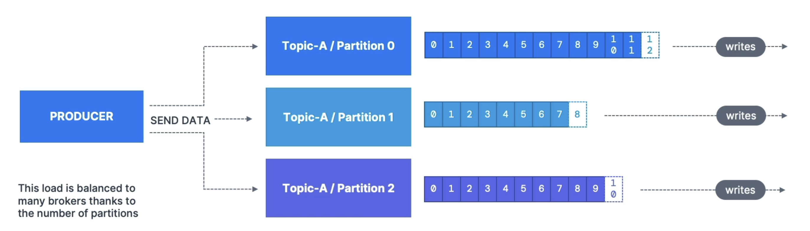
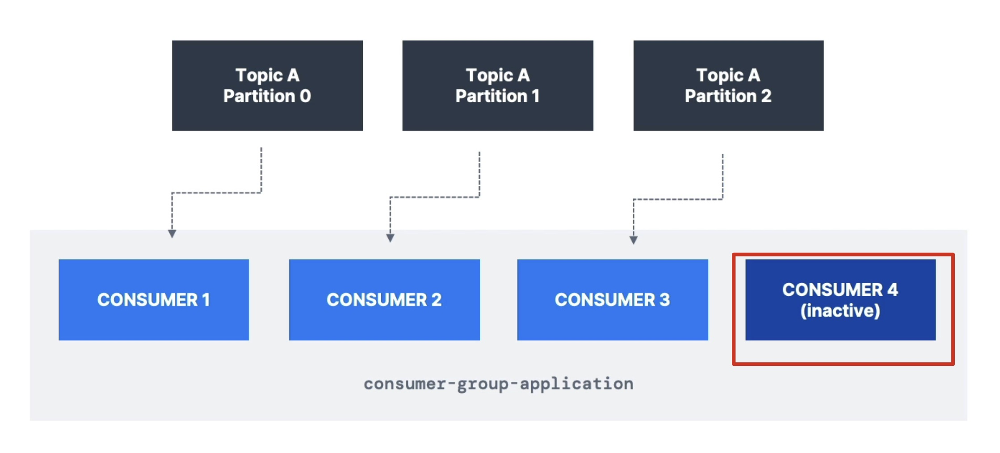
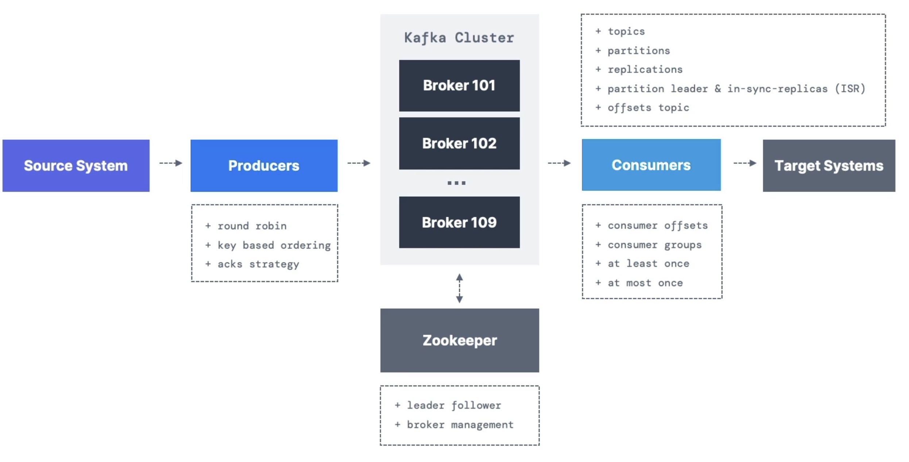

# kafka
This is the udemy course for kafka<br>
https://www.udemy.com/course/apache-kafka/learn/lecture/31409100?components=add_to_cart%2Cavailable_coupons%2Cbase_purchase_section%2Cbuy_button%2Cbuy_for_team%2Ccacheable_buy_button%2Ccacheable_deal_badge%2Ccacheable_discount_expiration%2Ccacheable_price_text%2Ccacheable_purchase_text%2Ccurated_for_ufb_notice_context%2Ccurriculum_context%2Cdeal_badge%2Cdiscount_expiration%2Cgift_this_course%2Cincentives%2Cinstructor_links%2Clifetime_access_context%2Cmoney_back_guarantee%2Cprice_text%2Cpurchase_tabs_context%2Cpurchase%2Crecommendation%2Credeem_coupon%2Csidebar_container%2Cpurchase_body_container#overview<br>


<br><br><br><br><br><br>

# 0. Setup

1. about kafka
    - data movement between systems become a problem
    - 4 src systems, 6 dest systems need 24 integrations
    - each integration comes with difficulties
        - protocol - how the data is transported(TCP, HTTP, REST, FTP, JDBC...)
        - data format - how the data is parsed (Binary, CSV, JSON, Avro, Protobuf...)
        - Data schema & evolution - how the data is shaped and may change
    - each src system will have an increased load from the connections
        - 
    - why kafka? decoupling of data streams & systems
        - 
        - 
        
    - why kafka so good?
        1. Created by linkedin, now open-source project mainly maintained by confluent, IBM, Cloudera
        2. Distributed, resilient architecture, fault tolerant
        3. horizontal scalability:
            - can scale to 100s of brokers
            - can scale to millions of msgs per second
        4. high performance(latency of less than 10ms) - real time
        5. used by the 2000+ firms, 80% of the fortune 100
    - Kafka use cases
        1. messaging system
        2. activity tracking
        3. gather metrics from many different locations
        4. application logs gathering
        5. stream processing (with the kafka strems API for example)
        6. de-coupling of system dependencies
        7. integrations with Spark, Flick, Storm, Hadoop, and many other big data tech
        8. micro-services pub/sub
    - FOR EXAMPELS
        1. `Netflix` uses kafka to apply recommendations in real-time while you're watching TV shows
        2. `Uber` uses kafka to gather uses, taxi and trip data in real-time to compute and forecast demand, and compute surge pricing in real-time
        3. `Linkedin` uses kafka to prevent spam, collect user interactions to make better connection recommendations in real time
    - `REMEMBER, kafka is only used as a transportation mechanism`

2. Course objectives
    - Course structures
        - Part 1
            1. Kafka Theory
            2. Starting Kafka
            3. Kafka CLI
            4. Kafka & Java101
        - Part 2
            1. wikimedia producer
            2. OpenSearch consumer
            3. extended API intro + case studies + kafka in the enterprise
        - Part 3
            1. Adavanced topic configuration
    - Who this course for
        - Developers, how to write and run an application that leverages kafka
        - Architects, understand role of kafka in the enterprise piepline
        - DevOps, how kafka works, topics, partitions and multi brokers setup
    
    - Kafka series
        1. kafka for beginners
        2. kafka connect API
        3. kafka streams API
        4. ksqlDB
        5. confluent components
        6. kafka security
        7. kafka monitoring and operations
        8. kafka cluster setup & administration
        9. confluent certifications for developers practice exams
        9. confluent certifications for operators practice exams

3. course material
    - download, https://www.conduktor.io/apache-kafka-for-beginners/
    - github, https://github.com/conduktor/kafka-beginners-course.git

<br><br><br><br><br><br>

# 1. Kafka theory

<br><br><br>

## 1.1 Topics, Partitions and offsets
1. Kafka Topics
    - `Topics`: a particular stream of daata
    - like a table in a database(without all the constraints)
    - you can have as many topics as you want
    - a topic is identified by its name
    - any kind of msg format
    - the sequence of msg is called a `data stream`
    - you cannot query topics, instead, use kafka producers to send data and kafka consumers to read the data

2. partitions and offsets
    - topics are split in `partitions`(example: 100 partitions)
        - msgs within each partition are ordered
        - each msg within a partition gets an incremental id, called `offset`
    - kafka topics are `immutable`: once data is written to a partition, it cannot be changed
    - 

3. Topic example: truck_gps
    - say u have a fleet of trucks, each truck reports its GPS position to kafka
    - each truck will send a msg to kafka every 20 seconds, each msg will contain the truck ID and truck position(latitude and longtidu)
    - you can have a topic `trucks_gps` that contains the position of all trucks
    - we choose to create that topic with 10 partitions (arbitrary number)
    - 
    

4. topics, partitions and offsets - important notes
    - once the data is written to a partition, `it can't be changed` (immutability)
    - data is kept only for a limited time(default is one week - configurable)
    - offset only have a meaning for a specific partition
        - e.g offset 3 in partition 0 doesn't represent the same data as offset 3 in partition 1
        - offsets are not re-used even if previous msgs have been deleted
    - order is guaranteed only within a partition (not across partitions)
    - data is assigned randomly to a partition unless a key is provided (more on this later)
    - you can have as many partiions per topic as you want

<br><br><br>

## 1.2 Producers and msg keys

1. producers
    - producers write data to topics (which are made of partitions)
    - producers know to which partition to write to (and which kafka broker has it)
    - in case of kafka broker failures, producers will automatically recover
    - 

2. producers: msg keys
    - producers can choose to send a `key` with the msg  (string, number, binary, etc...)
    - if key = null, data is sent round robin (partition 0, then 1, then 2...)
    - if key != null, then all msgs for that key will always go to the same partition (hashing)
    - a key are typically sent if you need msg ordering for a specific field(ex: truck_id)
    - 

3. kafka msg anatomy...
    - 

4. kafka msg serializer
    - kafka only accepts bytes as an input from producers and sends bytes out as an output to consumers
    - msg serialization means transforming objects/ data into bytes
    - they are used on the value and the key
    - common serializers
        - string (incl. JSON)
        - Int, Float
        - Avro
        - Protobuf
    - 

5. for the curious: kafka msg key hashing
    - a kafka partitioner is a code logic that takes a record and determines to which partition to send it into
    - `key hashing` is the process of determining the mapping of a key to a partition
    - in the default kafka partitioner, the keys are hased using the `murmur2 algorithm`, with the formula below for the curious:
    ```java
    targetPartition = Math.abs(Utils.murmur2(keyBytes)) % (numPartitions - 1)
    ```

<br><br><br>

## 1.3 Consumers & Deserialization
1. Consumers
    - consumers read data from a topic (identified by name) - pull model!
    - consumres automatically know which broker to read from
    - in case of broker failures, consumers know how to recover
    - data is read in order from low to high offset `within each paritions`
    - 

- Consumers Deserialization
    - deserialize indicates how to transform bytes into objects/ data
    - they are used on the value and the key of the msg
    - common deserializers
        - String(incl. JSON)
        - Int, Float
        - Avro
        - Protobuf
    - the serialization/ deserialization type must not change during a topic lifecycle (create a new topic instead)
    - 
    

<br><br><br>

## 1.4 Consumer Groups & Consumer Offsets
1. Consumer Groups
    - all the consumers in an application read data as a consumer groups
    - each consumer within a group reads from exclusive partitions
    - 

2. Consumer Groups - what if too many consumers?
    - if u have more consumers than partitions, some consumers will be inactive
    - 

3. Multiple Consumers on one topic
    - in apache kafka it is acceptable to have multiple consumer groups on the same topic
    - to create distinct consumer groups, use the consumer property group.id
    - 

4. Consumer Offsets
    - `Kafka` stores the offsets at which a consumer group has been reading
    - The offsets committed are in Kafka `topic` named `__consumer_offsets`
    - when a consumer in a group has processed data received from Kafka, it should be periodically committting the offsets(the kafka broker will write to __consumer_offsets, not the group itself)
    - if a consumer dies, it will be able to read back from where it left off thanks to the committed consumer offsets!
    - 

5. Delivery semantics for consumers
    - by default, Java consumers will automatically commit offsets (at least once)
    - there are 3 delivery semantics if you choose to commit manually
    - `At least once(usually preferred)`
        - offsets are committed after msg is processed
        - if the processing goes wrong, the msg will be read again
        - this can result in duplicate processing of msgs, make sure your processing is `idempotent` (i.e. processing again the msgs wont impact your systems)
    - `At most once`
        - offsets are committed as soon as msgs are received
        - if the processing goes wrong, some msgs will be lost(they won't be read again)
    - `Exactly once`
        - for kafka => kafka workflows: use the transactional API (easy with kafka streams API)
        - for kafka => external system workflows: use an `idempotent` consumer

<br><br><br>

## 1.5 Brokers and Topics
1. Kafka Brokers
    - A kafka cluster is composed of multiple brokers(servers)
    - Each broker is identified with its ID(integer)
    - Each broker contains certain topic partitions
    - After connecting to any broker(called a bootstrap broker), you will be connected to the entire cluster(Kafka clients have smart mechnics for that)
    - A good number to get started is 3 broker, but some big clusters have over 100 brokers
    - In these examples we choose to number brokers starting at 100 (arbitrary)
    - 

2. Brokers and topics
    - example of Topic-A with `3 partitions` and Topic-B with `2 partitions`
    - note: data is distributed, and broker 103 doesn't have any Topic B data
    - 

3. Kafka Broker Discovery
    - Every kafka broker is also called a `bootstrap server`
    - That means that `you only need to connect to one broker`, and the kafka clients will know how to be connected to the entire cluster (smart clients)
    - each broker knows about all brokers, topics and partitions(metadata)
    - 

<br><br><br>

## 1.6 Topic replication
1. Topic replication factor
    - topics should have a replication factor > 1 (usually between 2 and 3)
    - this way if a broker is down, another broker can serve the data
    - example: topic-A with 2 partitions and replication factor of 2
    - 

    - example: we lose broker 102
    - result: broker 101 and 103 can still serve the data
    - 

2. Concept of Leader for a partition
    - `at any time only ONE broker can be a leader for a given partition`
    - `producers can only send data to the broker that is leader of a partition`
    - the other brokers will replicate the data
    - therefore, each partition has one leader and multiple ISR (in-sync replica)
    - 


3. Default producer & consumer behavior with leaders
    - Kafka producers can only write to the leader broker for a partition
    - Kafka consumers by default will read from the leader broker for a partition
    - 

4. Kafka consumers replica fetching (Kafka v2.4+)
    - since Kafka 2.4, it is possible to configure consumers to read from closest replica
    - This may help improve latency, and also decrease network costs if using the cloud
    - 

<br><br><br>

## 1.7 Producer acknowledgements & topic durability

1. Producer acknowledgements (acks)
    - producers can choose to receive acknowledgement of data writes:
        - `acks=0`: producer won't wait for acknowledgement(possible data loss)
        - `acks=1`: producer will wait for leader acknowledgement(limited data loss)
        - `acks=all`: leader + replicas acknowledgment (no data loss)
    - 

2. Kafka Topic durability
    - for a topic replication factor of 3, topic data durability can withstand 2 brokers loss.
    - as a rule, for a replication factor of N, you can permanently lose up to N-1 brokers and stil recover your data.
    - 
    

<br><br><br>

## 1.8 zookeeper
1. zookeeper
    - zookeeper manages brokers (keeps a list of them)
    - zookeeper helps in performing leader election for partitions
    - zookeeper sends notifications to kafka in case of changes (e.g. new topic, broker dies, broker comes up, delete topics, etc...)
    - `kafka 2.x can't work without zookeeper`
    - `kafka 3.x can work without zookeeper(KIP-500) - using kafka raft instead`
    - `kafka 4.x will not have zookeeper`
    - zookeeper by design operates with an odd number of servers (1, 3, 5, 7)
    - zookeeper has a leader(writes) the rest of the servers are followers(reads)
    - (zookeeper does NOT store consumer offsets with kafka >v0.10)

2. zookeeper cluster(ensemble)
    - 
    

3. should u use zookeeper?
    - with kafka brokers?
        - yes, until kafka 4.0 is out while waiting for kafka without zookeeper to be production-ready
    - with kafka clients?
        - over time, the kafka clients and CLI have been migrated to leverage the brokers as a connection endpoint instead of zookeeper
        - since kafka 0.10, consumers store offset in kafka and zookeeper and must not connect to zookeeper as it is deprecated
        - since kafka 2.2, the kafka-topics.sh CLI command references kafka brokers and not zookeeper for topic management(creation, deletion, etc..) and zookeeper CLI argument is deprecated
        - All the APIs and commands that were previously leveraging zookeeper are migrated to use kafka instead, so that when clusters are migrated to be without zookeeper, the chnage is invisible to clients
        - zookeeper is also less secure than kafka, and therefore zookeeper ports should only be opened to allow traffic from kafka brokers, and not kafka clients
        - `Therefore, to be a greate modern-day kafka developer, never ever use zookeeper as a configuration in your kafka clients, and other programs that connect to kafka`

<br><br><br>

## 1.9 kafka KRaft - removing zookeeper
1. about kafka KRaft
    - in 2020, the apache kafka project started to work `to remove the zookeeper dependency` from it (KIP-500)
    - zookeeper shows scaling issues when kafka clusters have > 100,000 partitions
    - by removing zookeeper, apache kafka can
        - scale to millions of partitions, and becomes easier to maintain and set-up
        - improve stability, makes it easier to monitor, support and administer
        - single security model for the whole system
        - single process to start with kafka
        - faster controller shutdown and recovery time
    - kafka 3.x now implements the Raft protocol (KRaft) in order to replace zookeeper
        - production ready since kafka 3.3.1(KIP-833)
        - kafka 4.0 will be released only with KRaft(no zookeeper)

2. kafka KRaft architecture
    - 

3. KRaft performance improvements
    - 

<br><br><br>

## 1.10 Theory Roundup
1. kafka concepts
    - 
    


<br><br><br><br><br><br>

# 2. Starting Kafka

## 2.1 Starting Order
1. Important: Starting Kafka
    - for the rest of the course, we will start kafka...
    - on the cloud with conduktor, with a secure connection
    - locally: it will be accessible on 127.0.0.1(localhost)
    - natively: we will use the native kafka binaries from the website
    - with ONE Broker and (optionally) ONE zookeeper only (perfect for development)
    - `Note`: the production-ready kafka cluster setup takes over 4 hours and is dedicated to another course in the apacha kafak series

2. kafka installation
    - https://www.conduktor.io/get-started/#via-docker
    ```bash
    $ curl -L https://releases.conduktor.io/quick-start -o docker-compose.yml && docker compose up -d --wait && echo "Conduktor started on http://localhost:8080"

    $ curl -L https://releases.conduktor.io/console -o docker-compose.yml && docker compose up -d --wait && echo "Conduktor started on http://localhost:8080"
    ```
    - 

## 2.2 start kafka

kafka tutorial: https://www.conduktor.io/kafka/how-to-install-apache-kafka-on-mac-with-homebrew/<br>

1. start from binary tgz
```bash
https://rickeve.conduktor.app/admin/members?page=1&tab=members

# 1. downlaod java11

# 2. download kafka
https://kafka.apache.org/downloads

# 3. setup kafak path
export PATH="$PATH:/Users/runzhou/git/kafka/kafka_2.13-3.5.1/bin"
```

2. mac os x
```bash
# 1. start zookeeper
$ zookeeper-server-start.sh kafka_2.13-3.5.1/config/zookeeper.properties 

# 2. start server
$ kafka-server-start.sh kafka_2.13-3.5.1/config/server.properties

```


3. max os x: start kafka using brew
```bash
# 1. install brew
$ /bin/bash -c "$(curl -fsSL https://raw.githubusercontent.com/Homebrew/install/HEAD/install.sh)"

# 2. install kafka using brew
$ brew install kafka

# 3. start zookeeper
# bash location
/usr/local/etc/kafka

# 4. start kafka
$ /usr/local/bin/zookeeper-server-start /usr/local/etc/zookeeper/zoo.cfg
$ /usr/local/bin/kafka-server-start /usr/local/etc/kafka/server.properties

```
    